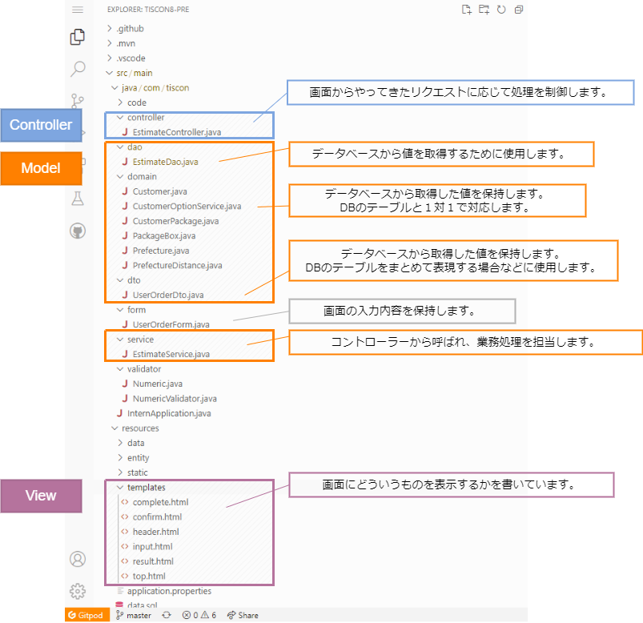

# Webアプリケーションの基礎知識

Webアプリケーションの仕組みやHTMLの書き方について学んでおくことで、開発をスムーズに進めることができるようになります。

## 学習の目的

本インターンシップはIT経験不問としているため、参加者によって知識・経験に差があります。（得意な分野が異なる）  
プログラミングにあまり慣れていない人もいれば、自分でWebアプリケーションの開発をしたことがある人もいます。  

そこで、事前に「Webアプリケーションの基礎知識」を学ぶことで、インターンシップをより充実したものにしていきましょう。 
また、IT業界に携わるのであればインターンシップ以外でも長く役立つ知識になります！

## 学習方法

- 共通
   - 下記手順に従い、学習を進めてください
   - 暗記する必要はありません。Webアプリケーションの開発の流れを理解し、イメージできるようになりましょう
   - 想定時間を記載していますが、各自のペースで学習を進めてください
   - 理解ができているかどうかは、チェックリストをもとに判断してください
- Webアプリケーション開発経験のある人
   - 既知の箇所については早送りなどして効率よく学習してください
   - 既知かどうかは、チェックリストで確認できます
- Webアプリケーション開発経験のない人
   - 初心者向けにわかりやすい動画を選んでいます。安心して学習を進めてください

## レベル０

本インターンシップで取り扱っている技術要素のうち、３つの単語を覚えてください。  
現時点では「こんな単語があるんだな」と軽く覚えておけば、大丈夫です。

- [Java](https://www.java.com/ja/download/help/whatis_java.html)：プログラミング言語
- [HTML](http://www.htmq.com/htmlkihon/001.shtml)：Webページを作成するためのマークアップ言語
- [Spring Boot](https://spring.io/projects/spring-boot)：Javaのアプリケーションフレームワーク

## レベル１ 想定時間：15min

まずは、Webアプリケーションとは何なのかについて学びましょう。  
以下をクリックし、動画を見てください。

[Webアプリが動く仕組みや開発できる言語の違いを初心者向けに解説【JavaWeb入門講座1】Webアプリケーションとは](https://www.youtube.com/watch?v=IcTHcOYsrwo)

以下が理解できていればOKです。

- [ ] Webページを見るときには、2つのコンピューター（webブラウザ、webサーバ）が動いている
- [ ] 「リクエスト」は、webページの情報をwebサーバに要求することである
- [ ] 「リクエスト」では、URLや画面への入力情報などが送られる
- [ ] 「レスポンス」は、リクエストに対してwebサーバが情報を返すことである
- [ ] 「レスポンス」では、HTMLが返される

## レベル２　想定時間：40min

レスポンスで返される『HTML』という言語の基本を学びましょう。  
以下をクリックし、動画を見てください。

[HTMLの基本とタグの書き方を初心者向けに解説【JavaWeb入門講座2】HTML入門](https://www.youtube.com/watch?v=U9Pe6ftnHtY)

以下が理解できていればOKです。

- [ ] HTMLとは、タグを使って意味づけができる言語である
- [ ] HTMLでは、開始タグと終了タグが必要である

次に、入力情報を「リクエスト」するために必要な『フォーム』について学びましょう。  
以下をクリックし、動画を見てください。

[HTMLフォームの作り方とGET・POST送信の違い【JavaWeb入門講座3】フォーム画面の作り方](https://www.youtube.com/watch?v=qTISEtmruVs)

- [ ] フォーム画面とは、入力情報をwebサーバに送れるページである
- [ ] フォーム画面を作るためには、HTMLにおいて `form` タグで囲う必要がある
- [ ] リクエストでは、入力値に名前を付けて送信できる（例： name=TIS太郎 ）

## レベル３　想定時間：25min

Javaのアプリケーションフレームワークである『Spring Boot』を使った開発について学びましょう。  
以下をクリックし、動画を見てください。  

__※実際にソースコードを書いたり動かす必要はありません__

[Spring Bootで占いwebアプリを作ってみよう！【JavaでSpringBoot開発 #1】](https://www.youtube.com/watch?v=8UERVg5c_HM)

以下が理解できていればOKです。

- [ ] Spring BootとはJava開発で用いられるフレームワークである
- [ ] MVCモデルにおいて、Controller（Java）はリクエストを受け付けるところである
- [ ] MVCモデルにおいて、Model（Java）はアプリケーションで実装したい処理をまとめたところである
- [ ] MVCモデルにおいて、View（HTML）は画面を表示するところである

## レベル４　想定時間：30min

事前の環境構築を行うと、Gitpod上で以下のようなプログラムが確認できます。  
これまでの説明と照らし合わせて、Controller, Model, Viewの役割と呼び出される流れを確認してみましょう。

お疲れさまでした！
