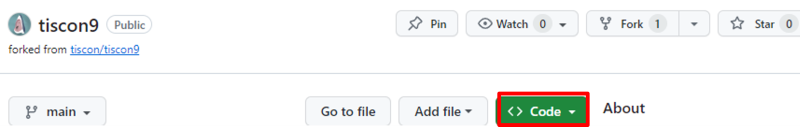
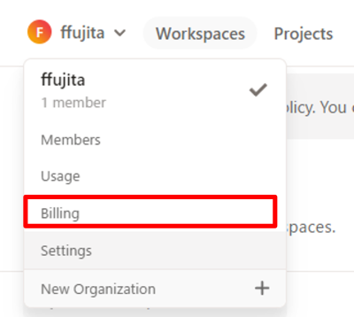

# 動作確認

## 手順

以下手順に従い、動作確認を行ってください。  
なお、一部画面キャプチャ内にある「tiscon9-pre」は「tiscon9」に読み替えてください。

- [動作確認](#動作確認)
  - [手順](#手順)
  - [構成図](#構成図)
    - [1.GitHubリポジトリのFork](#1githubリポジトリのfork)
    - [2.Gitpodのログイン](#2gitpodのログイン)
    - [3.Workspaceの作成](#3workspaceの作成)
    - [4.Webアプリケーションの起動確認](#4webアプリケーションの起動確認)
      - [「BUILD SUCCESS」と表示されている場合](#build-successと表示されている場合)
    - [5.Webアプリケーションの終了](#5webアプリケーションの終了)
    - [もう一度起動したい場合](#もう一度起動したい場合)

## 構成図

本手順によって構築される環境の概念図は以下のようになります。

### 1.GitHubリポジトリのFork

1. 以下を押下し、インターンシップ向けアプリにアクセスして下さい。  
   1. https://github.com/tiscon/tiscon9
1. GitHubの画面右上 `Fork` ボタンを押下します。  

1. `Create Fork` を押下します。画面が切り替わります。  

1. 画面左上で [自分のGitHubユーザ名]/tiscon9 となっていればOKです。  

1. `Code` を押下します。  

1. 図のクリックボードアイコンを押下し、URLをコピーします。  

### 2.Gitpodのログイン

1. 以下にアクセスし、 `Continue with GitHub` を押下します。
   1. https://gitpod.io/login  

2. GitHubへのログインやアクセス権の付与を求められた場合は、従ってください。
   
   
    
    
    
3. 氏名を入力し、`Continue with 10 hours per month`をクリックします
   
   

4. エディターの選択画面が出るので、 editorは変更せず`Continue` を押下します。
   
   

5. 各項目を選択して`Continue`を押下します。
   
   

6. 自分のWorkspace画面が確認できれば登録完了となります

   

### 3.Workspaceの作成

1. 「Workspaces」画面に遷移します。 
2. `New Workspace` を押下します。
3. 「Repository」欄を開き、手順1-6 でコピーしたURLを入力＆選択します。その後、 `Continue` を押下します。   

1. 電話番号の入力を求められることがあります。その場合はインターンシップ当日に利用可能な電話番号を入力し、`Send Code via SMS` を押下します。  

1. 電話番号を入力した場合は、届いたSMSに記載されている認証コードを入力し、 `Validate Account` を押下します。
2. 以下のような画面となったら、 `continue` を押下します。  

1. 起動が完了するまで1,2分程度待ちます。  

1. 以下のような画面に遷移し、プロジェクト内のソースコードが確認できるようになりました。　※時刻が深夜となっていますが、時差により9時間ズレが生じるためです。  

画面下部の以下部分を「Terminal」と呼びます。  
文字（コマンド）を打つことで、コンピュータに指示ができ、アプリケーションの起動などをすることができます。  

### 4.Webアプリケーションの起動確認

1. まずは、Terminalの下部に緑色の文字で「BUILD SUCCESS」という表示が出ていることを確認します。異なる表示の場合は、問い合わせ手順に従ってお問い合わせください。

#### 「BUILD SUCCESS」と表示されている場合

1. Terminalの一番下にコマンドを入力していきます。  

1. `mvn install` と入力し、Enterキーを押下します。  

1. 緑色の文字で「BUILD SUCCESS」という表示が出ていればOKです。  

1. 次に `mvn spring-boot:run` と入力し、Enterキーを押下します。  

1. `Started InternApplication` と表示されていればOKです。  

1. 画面右下 `Open Browser` を押下し、ブラウザを開いて画面が表示されることを確認します。  

1. 通知が消えてしまっている場合は、右下のベルマークを押下すると再度表示されます。  

1. 以下のような画面が立ち上がったらOKです。  

### 5.Webアプリケーションの終了

動作が確認できたらアプリケーションを終了しましょう。  

1. Gitpod画面左下の `Gitpod` を押下します。  

1. 画面上部に表示された `Gitpod: Stop Workspace` を押下します。  

1. Workspaceの停止を知らせる画面が表示されればOKです。  

### もう一度起動したい場合

`Go To Dashbord` を押下すると、Workspace一覧が表示されます。  
対象のWorkspace右の `縦三点リーダー > Open` からWorkspaceを起動できます。

Terminalが表示されたら、 `mvn spring-boot:run` と入力し、Enterキーを押下することで起動することができます。  

ただし、Workspace作成後２週間経過するとWorkspaceは自動的に削除されてしまいます。  
その場合は、手順3「Workspaceの作成」を再度実施していただくことで、再度確認できます。

__※Workspaceの起動時間には50h/monthの制限があります。__  
__インターンシップ当日に利用できるようにするため、15時間以上残してください。__

「何時間くらい使ったの？」と気になる方は、 `Workspace一覧>画面左上のアカウントアイコン > Billing` から残り利用可能時間が確認できます。（10Creditsで1時間利用できます）

__お疲れ様でした！次は事前学習へ進んでください。__
